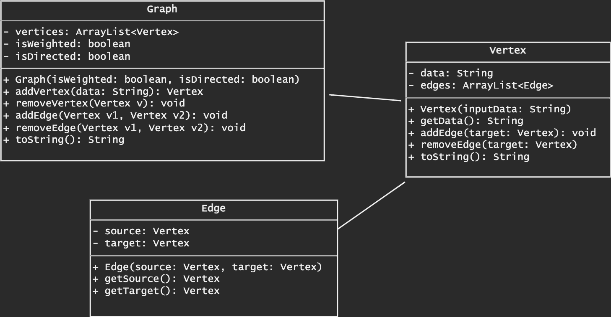

# Graph

A graph consists `nodes` and `edges`.

## Graph Representation

Graph Representation Implemetation in Java

```java
import java.util.ArrayList; 

class Edge {
    private Vertex source;
    private Vertex target;
    
    public Edge(Vertex source, Vertex target){
        this.source = source;
        this.target = target;
    }
    
    public Vertex getSource(){
        return this.source;
    }
    
    public Vertex getTarget(){
        return this.target;
    }
}

class Vertex {
    private String data;
    private ArrayList<Edge> edges;
    
    public Vertex(String inputData){
        this.data = inputData;
        this.edges = new ArrayList<Edge>();
    }
    
    public String getData(){
        return this.data;
    }
    
    public ArrayList<Edge> getEdges(){
        return this.edges;
    }
    
    public void addEdge(Vertex target){
        this.edges.add(new Edge(this, target));
    }
    
    public void removeEdge(Vertex target){
        this.edges.removeIf(edge -> edge.getTarget().equals(target));
    }
}

class Graph {
    private ArrayList<Vertex> vertices;
    private boolean isWeighted;
    private boolean isDirected;
    
    public Graph(boolean isWeighted, boolean isDirected){
        this.vertices = new ArrayList<Vertex>();
        this.isWeighted = isWeighted;
        this.isDirected = isDirected;
    }
    
    public Vertex addVertex(String data){
        Vertex v = new Vertex(data);
        this.vertices.add(v);
        return v;
    }
}

class Main {
    public static void main(String[] args) {
        System.out.println("Graph Tutorial");
        Vertex v1 = new Vertex("1");
        System.out.println("Data");
        System.out.println(v1.getData());
        Vertex v2 = new Vertex("2");
        Vertex v3 = new Vertex("3");
        v1.addEdge(v2);
        v1.addEdge(v3);
        System.out.println("Before\n");
        System.out.println(v1.getEdges());
        v1.removeEdge(v2);
        System.out.println("After\n");
        System.out.println(v1.getEdges());
        
        Graph g = new Graph(false, true);
        g.add(v1);
    }
}
```

### UML

